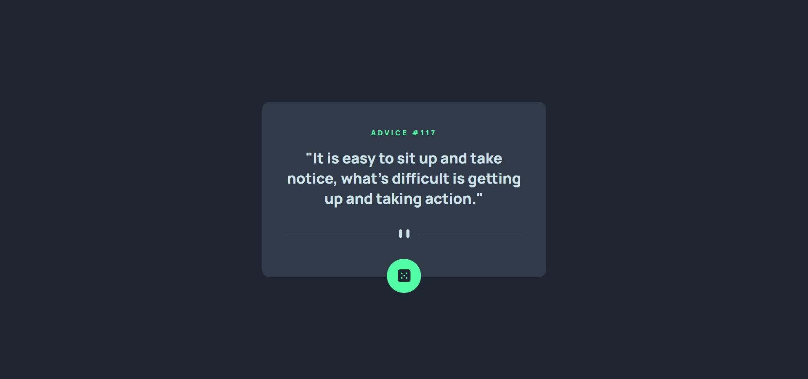

# Advice Generator App | solution to the Frontend Mentor challenge

This is a solution to the [Advice generator app challenge on Frontend Mentor](https://www.frontendmentor.io/challenges/advice-generator-app-QdUG-13db). Frontend Mentor challenges help you improve your coding skills by building realistic projects.

## Screenshot

## Links

- Advice Slip API: (https://api.adviceslip.com)
- Live Site Url: (https://advice-generator-km9.netlify.app)

## Features

- Click the button (green button with dice icon) to generate a random advice
- After generating, you have to wait 2 seconds to generate a new advice again (the button changes the background to dark grey)
- Advices are fetched from the Advice Slip API

## Built with

- HTML5
- SASS/SCSS
- JavaScript

## Author

- Frontend Mentor - (https://www.frontendmentor.io/profile/k-malkiewicz)
- Codewars - (https://www.codewars.com/users/k_malkiewicz)
- iCodeThis - (https://www.icodethis.com/BAGI3TA)

